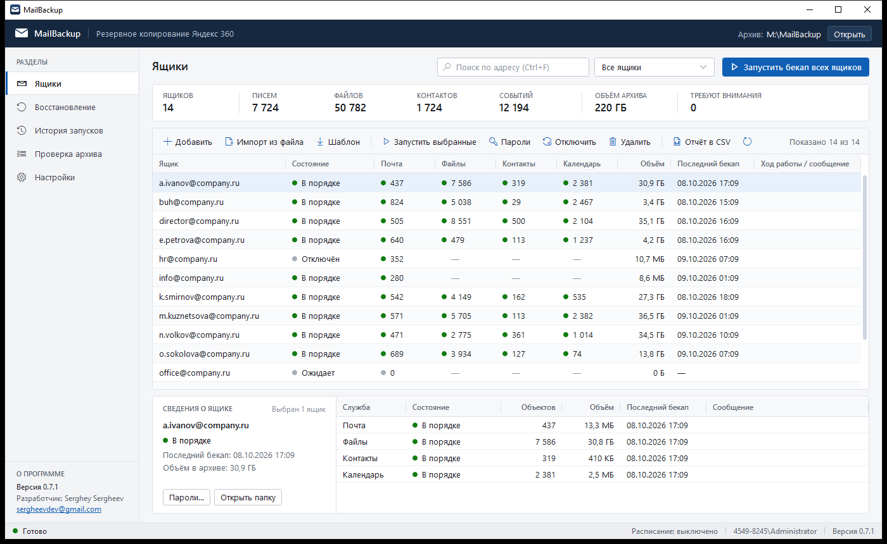
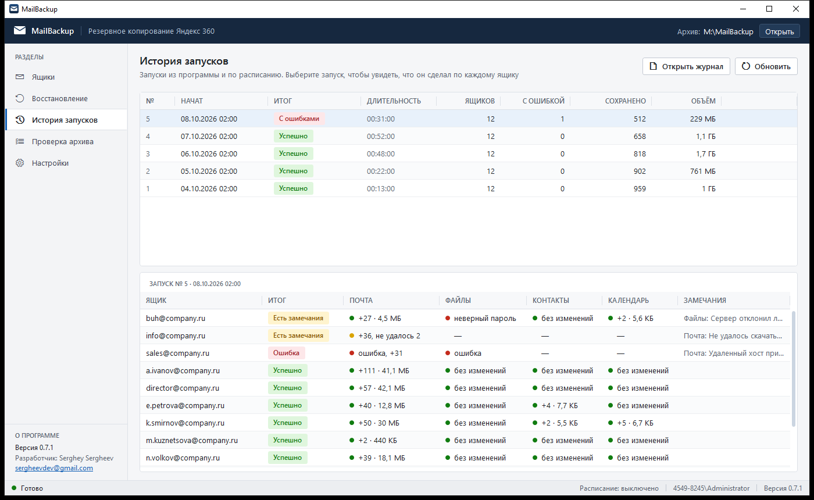
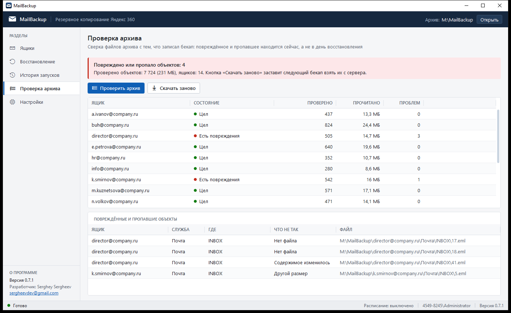

# MailBackup

Программа для Windows, которая делает резервную копию учётных записей Яндекс 360: почты, файлов Диска,
контактов и календаря. Копия складывается в обычную папку на этом компьютере или в сети.

Установочник: **[MailBackup-0.7.2-x64.msi](MailBackup-0.7.2-x64.msi)** (откройте ссылку и нажмите Download).



## Что она делает

- Скачивает письма, файлы, контакты и события всех ящиков из списка.
- Если бекап прервался (выключили компьютер, пропала сеть), следующий запуск продолжает с того же места.
  Уже скачанное второй раз не скачивается.
- Запускается сама по расписанию и присылает письмо с результатом.
- Восстанавливает данные обратно: в тот же ящик, в другой ящик Яндекса или на другой почтовый сервер.

Архив хранится в открытом виде. Письма лежат файлами `.eml`, контакты `.vcf`, события `.ics`,
файлы Диска сохраняются как есть. Всё это можно открыть и без программы.

## Что понадобится

- Windows 10, 11 или Windows Server 2016 и новее, 64-разрядная.
- Права администратора. Нужны только на время установки.
- Папка для архива с достаточным местом: примерно столько, сколько занимают ящики и Диски.
- Пароли приложений для каждого ящика (о них ниже). Обычный пароль от Яндекса не подойдёт.

## Установка

1. Скачайте `MailBackup-0.7.2-x64.msi` и запустите.
2. Пройдите мастер установки. Больше ничего ставить не нужно, всё необходимое внутри.
3. Запустите MailBackup с рабочего стола или из меню «Пуск».

Обновление ставится так же, поверх старой версии. Список ящиков, настройки и архив при обновлении
и при удалении программы остаются на месте.

## Пароли приложений

Яндекс не пускает программы по обычному паролю. Вместо него владелец ящика создаёт пароли приложений:
[id.yandex.ru](https://id.yandex.ru) → «Безопасность» → «Пароли приложений».

У каждого вида данных свой пароль:

| Что сохранять | Какой пароль создать |
|---|---|
| Письма | Почта |
| Файлы Диска | Файлы |
| Контакты | Контакты |
| Календарь | Календарь |

Пароль от почты не подойдёт к файлам, и наоборот. Если файлы не нужны, пароль «Файлы» можно не создавать:
программа просто пропустит эту часть.

Для почты в настройках ящика должен быть разрешён доступ почтовых программ по IMAP
(Почта → «Все настройки» → «Почтовые программы»).

## Первый бекап

**1. Укажите папку архива.** «Настройки» → «Папка архива». Подойдёт локальный диск или сетевая папка
вида `\\server\backup`. Внутри программа создаст по папке на каждый ящик.

**2. Добавьте ящики.** Есть два способа.

- По одному: «Ящики» → «Добавить», ввести адрес и пароли приложений.
- Списком: кнопка «Шаблон» в разделе «Ящики» сохраняет файл-образец. Заполните его в Блокноте или Excel
  и загрузите кнопкой «Импорт из файла».

В файле списка каждая строка описывает один ящик:

```
адрес;пароль почты;пароль файлов;пароль контактов;пароль календаря
ivanov@company.ru;abcdabcdabcdabcd;efghefghefghefgh;ijklijklijklijkl;mnopmnopmnopmnop
petrov@company.ru;qwerqwerqwerqwer;;;
```

У второго ящика указан только пароль почты, поэтому у него сохранятся только письма.

После импорта удалите файл со списком: в нём пароли открытым текстом. В программе они хранятся
зашифрованными и доступны только тому пользователю Windows, который их ввёл.

**3. Запустите.** Кнопка «Запустить бекап всех ящиков». Первый раз это долго, потому что скачивается всё.
Следующие запуски забирают только новое.

Бекап можно прервать кнопкой «Остановить». Ничего не испортится, в следующий раз он продолжит
с того же места. Во время бекапа можно добавлять новые ящики и запускать их, не дожидаясь его конца.

## Как понять, что всё в порядке

В таблице у каждого ящика четыре колонки: почта, файлы, контакты, календарь. Зелёная точка означает,
что данные сохранены, красная говорит об ошибке, а прочерк стоит там, где пароль не задан.
Текст ошибки виден внизу, если выбрать ящик.

Чаще всего встречается ошибка «Сервер отклонил логин или пароль». Значит, пароль приложения введён неверно,
отозван или создан не того типа (например, пароль «Почта» вписан в поле календаря). Создайте новый
пароль в Яндексе, выберите ящик, нажмите «Пароли» и впишите его. Остальные поля можно не трогать.

Раздел «История запусков» показывает все бекапы. Если выбрать запуск, ниже появится, что он сделал
по каждому ящику.



## Бекап по расписанию

«Настройки» → «Расписание». Можно выбрать: каждый день, по дням недели, раз в месяц или каждые
несколько часов.

Если это сервер, на который никто не входит, поставьте галочку «Запускать, даже если пользователь
не вошёл в систему». Программа один раз спросит пароль от учётной записи Windows. Он нужен
Планировщику заданий, сама программа его не сохраняет. После смены пароля Windows его нужно ввести заново.

Там же, в настройках, включаются письма с результатом: после каждого бекапа или только когда
что-то пошло не так.

## Сколько хранить

«Настройки» → «Хранение». По умолчанию из архива ничего не удаляется: письмо, удалённое в ящике,
в архиве остаётся. При желании можно задать:

- через сколько дней убирать из архива то, что удалено на сервере;
- сколько прежних версий изменённых файлов Диска держать;
- сколько снимков архива хранить. Снимком называется состояние архива на дату бекапа. Из него можно
  восстановить ящик таким, каким он был в тот день.

## Восстановление

Раздел «Восстановление».

1. Выберите ящик из архива и откуда брать данные: из текущего архива или из снимка на дату.
2. Укажите, куда восстанавливать: адрес ящика и его пароли приложений. Это может быть тот же ящик,
   другой ящик Яндекса или другой сервер (тогда впишите его адреса).
3. Нажмите «Начать восстановление».

Восстанавливаются письма с папками, отметками о прочтении и метками, файлы, контакты и события.
На сервере ничего не удаляется и не затирается. Если восстановление прервалось, запустите его снова:
уже загруженное повторно не загрузится.

Несколько ящиков сразу восстанавливаются по списку: переключатель «Несколько по списку», там же
кнопка, которая сохраняет образец файла.

Правила обработки писем, подписи и настройки ящика не восстанавливаются, потому что их нет в бекапе.

## Проверка архива

Диски портятся, файлы случайно удаляют. Раздел «Проверка архива» перечитывает сохранённые письма
и сверяет их с контрольными суммами, записанными при скачивании. Так повреждение находится заранее,
а не в тот день, когда архив понадобился.



Если что-то повреждено, кнопка «Скачать заново» заставит следующий бекап взять эти письма с сервера ещё раз.
Учтите: если письма на сервере уже нет, вернуть его не получится.

Проверяются письма (полностью), контакты и события (наличие и размер). Файлы Диска не проверяются.

## Частые вопросы

**Бекап прервался. Нужно что-то делать?**
Нет. Запустите его снова или дождитесь расписания, он продолжит сам.

**Можно перенести архив на другой диск?**
Да. Перенесите папку целиком и укажите новый путь в настройках.

**Можно перенести программу на другой компьютер?**
Архив можно. Пароли ящиков придётся ввести заново: они зашифрованы под конкретного пользователя Windows
и на другом компьютере не откроются.

**Где программа хранит свои данные?**
Список ящиков, настройки и журналы лежат в `%LOCALAPPDATA%\MailBackup`. Сам архив находится в папке,
указанной в настройках.

**Можно ли запускать без окна?**
Да. Вместе с программой ставится `mailbackup-cli.exe`, он делает то же самое из командной строки.
Список команд: `mailbackup-cli --help`.

## Автор

Serghey Sergheev, sergheevdev@gmail.com
